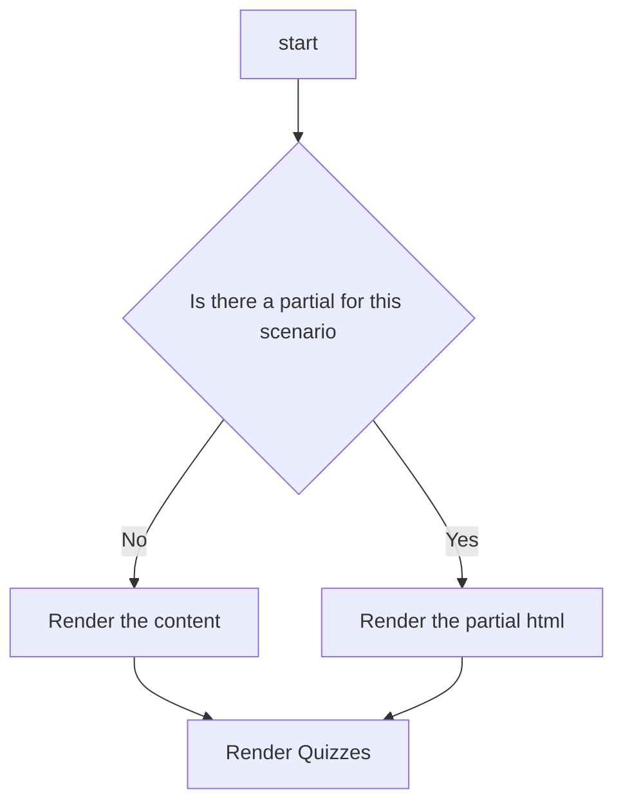
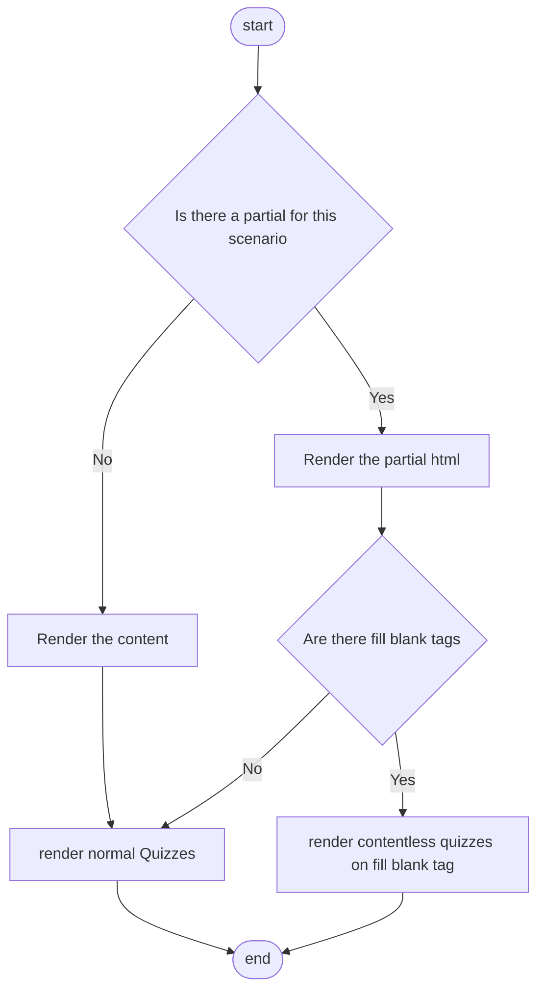

# MomiTestAsp - Development Notes
## 2021-06-29 Better site navigation

- [ ] Need a better way to structure exams in database

An exam is a set of quizzes, which can be performed with various settings, such as:

- Max time limit to answer each question
- How questions are drawn => meaning that scenarios must have tags
- Toggle between check explicitly or implicitly
- Session state to store the entire exam session

All of these features must be done only after I come up with a better way to store data into SQL database. And yes, this include the partials.

Actually storing partials are not the problem. Since html is structure document. The problem is how to effectively code them into the database, and after that, how to effectively change that if an error is detected.

- [ ] Need a better way to present exams on website

## 2021-07-07 Database Migration and Data2Quiz Rendering

I want to design a better model for a better quiz rendering logic, preferably putting the validation logic on the server side.

### Home design

Simple, flex box which contains cards to show practice set information. Possible improvements:

- [ ] Search by topic
- [ ] Filter by topic

Also a portal to the admin tab, which can be used to add content hot.

### Data2Quiz Rendering

I want to have three types of quizzes:

- single / multiple choice
- sequential choice
- fill the blanks

I already have a working framework for the first two, but for fill blanks there need to be some workaround.

There are several difficulties to be managed before we can build a **universally applicable data template for all types of questions**.

For fill in the blanks, you have a large formatted text, probably in html, that serves as a base for the quizzes. The existing model might fit but there is the problem with validation and explanation phase.

I think the current model can handle the fill the blanks type quizzes. The logic handler is built-in after all.

Start to render quizzes follows the same logic. But with a twist: there are scenarios that are fill-in-a-blank types.

Therefore, a fill blank quiz is defined as a scenario with a partial as its statement body, within which some special tags are in place, ready to receive the pre-set quizzes into the position.

The fill blank quizzes are statement less, or even if you write them, would be ignored in the rendering process. Only options are rendered.

## Authorization and hot data submission

So far the data has been static. I need a way to initialize the database structure with some dummy data, and then build an admin page to allow item editing for error correction, and new data submission.

